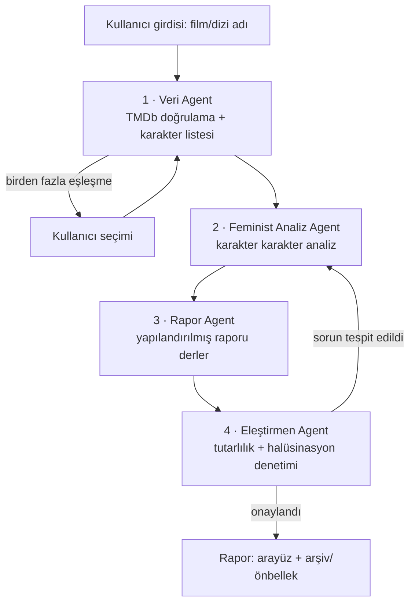
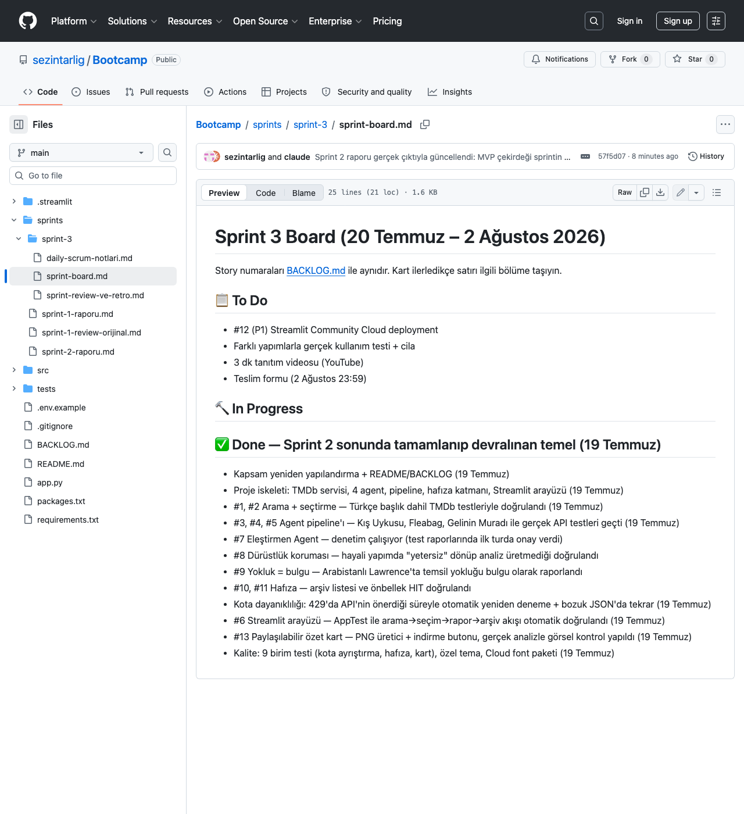
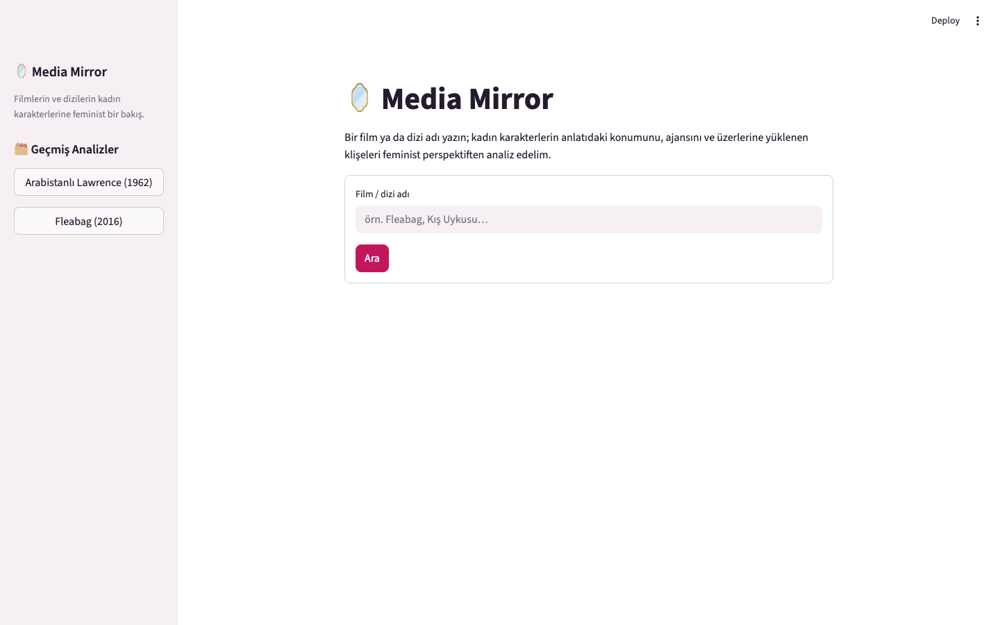
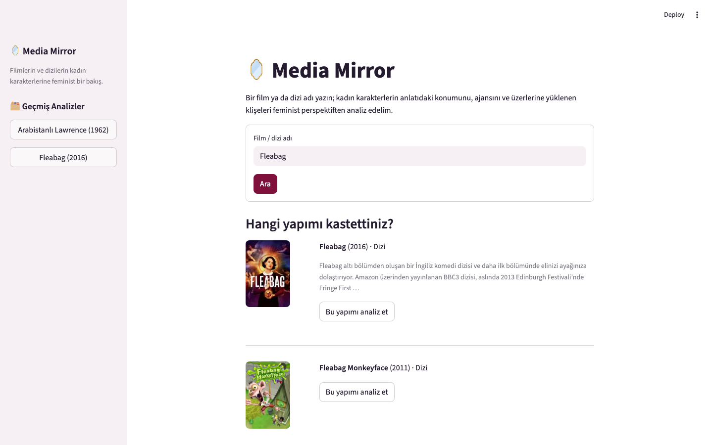
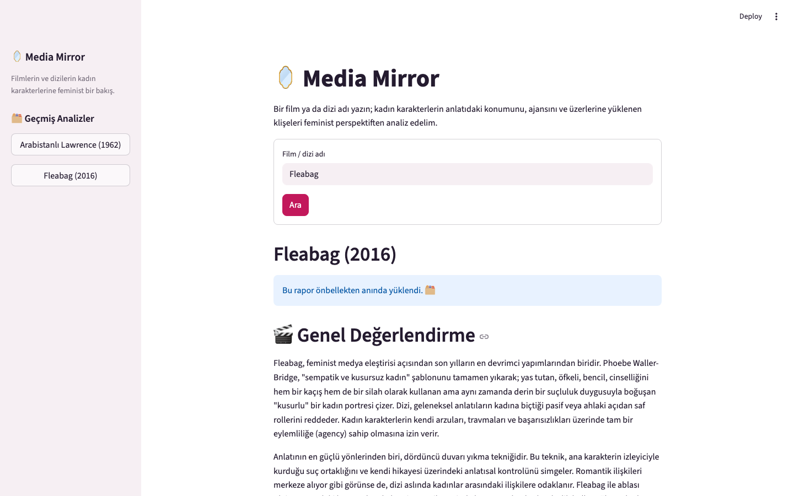
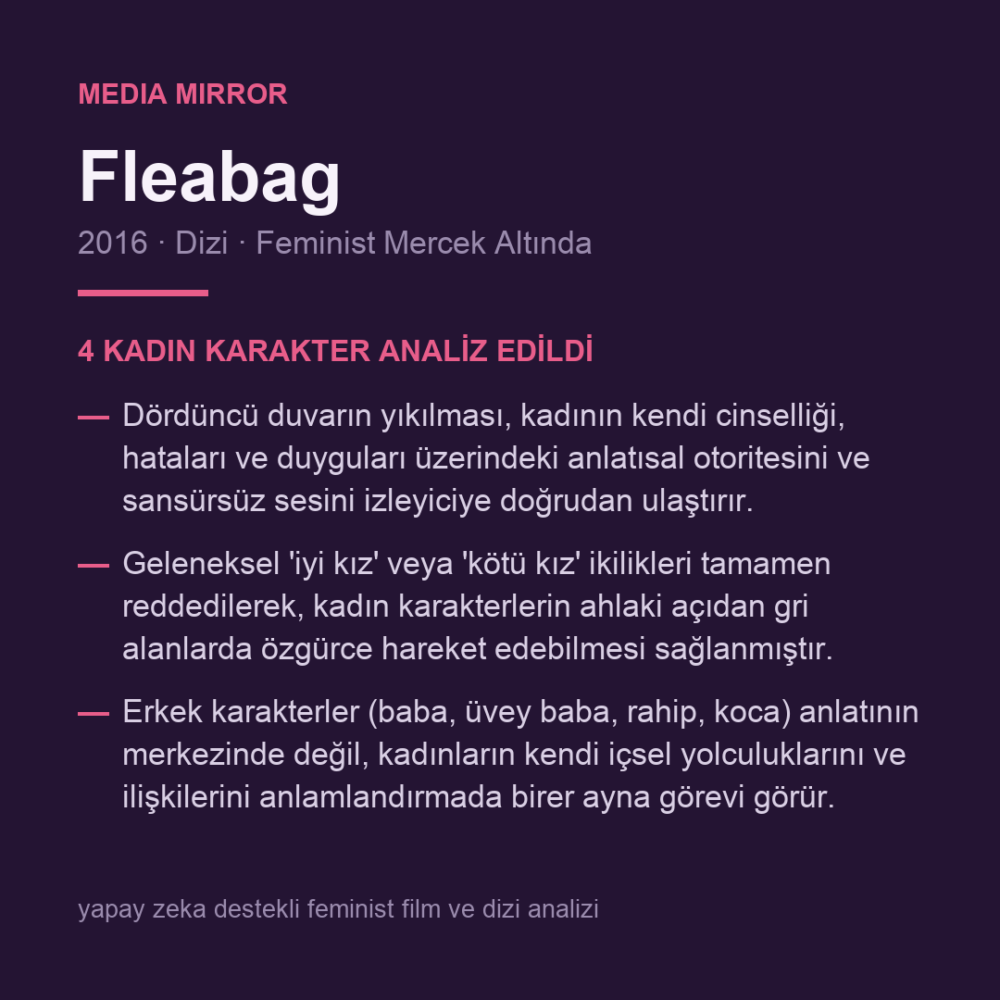

# Media Mirror (Medya Aynası)

> **Filmlerin ve dizilerin kadın karakterlerine feminist bir bakış.**

## Takım İsmi
Media Mirror — Solo Takım

*(5 kişilik olması planlanan takım, iletişim kopukluğu nedeniyle tek kişi tarafından yürütülmektedir. Süreç detayları için bkz. [Sprint Raporları](#sprint-raporları).)*

## Takım Rolleri
Proje tek kişi tarafından yürütülmektedir; aşağıdaki roller aynı kişi (Sezin) tarafından üstlenilmiştir:

- **Product Owner:** Ürün vizyonu, kapsam kararları, backlog önceliklendirme
- **Scrum Master:** Sprint planlama, süreç takibi, engellerin yönetimi
- **Developer:** Teknik geliştirme, API entegrasyonu, AI agent orkestrasyonu

## Ürün İsmi
Media Mirror (Medya Aynası)

## Ürün Açıklaması
Media Mirror, izleyicilerin bir film veya dizideki **kadın karakterlerin konumunu feminist perspektiften** anlamasını sağlayan bir yapay zeka analiz aracıdır.

Kullanıcı bir film ya da dizi adı girer; sistem yapımı TMDb üzerinden doğrular, ardından çok adımlı bir AI agent orkestrasyonu ile kadın karakterlerin anlatıdaki yerini, karar alma gücünü (ajans) ve üzerlerine yüklenen klişeleri analiz eden **yapılandırılmış, Türkçe bir rapor** üretir.

Var olan araçlar (örn. Bechdel testi) tek boyutlu bir "geçti/kaldı" sonucu verirken, Media Mirror karakter düzeyinde nitel ve gerekçeli bir yorum sunar.

### Çekirdek Akış
1. Kullanıcı film/dizi adı girer (Türkçe veya orijinal başlık).
2. Sistem TMDb'de arama yapar; birden fazla eşleşme varsa kullanıcıya poster ve yıl bilgisiyle **seçim listesi** sunar.
3. Agent pipeline'ı çalışır ve rapor üretilir.
4. Rapor arşive kaydedilir; aynı yapım tekrar sorgulandığında önbellekten anında gelir.

### Rapor Yapısı
Her analiz şu sabit bölümlerden oluşur:

| Bölüm | İçerik |
|---|---|
| 🎬 Genel Değerlendirme | Yapımın kadın temsiline feminist perspektiften 1-2 paragraflık özet bakış |
| 👥 Kadın Karakter Analizi | Karakter karakter: anlatıdaki konumu, ajansı (karar alma gücü), ilişkilenme biçimleri |
| 🏷️ Klişeler & Troplar | Tespit edilen kalıplar (ör. "manic pixie dream girl", "fridging") ve bunların nasıl kullanıldığı/kırıldığı |
| ⭐ Öne Çıkan Bulgular | En çarpıcı 3-5 madde |

## Ürün Özellikleri

### MVP Kapsamı
- Film **ve dizi** desteği; Türkçe veya orijinal başlıkla arama
- TMDb entegrasyonu: yapım doğrulama, karakter/oyuncu listesi, belirsiz aramalarda kullanıcıya seçtirme
- **4 agent'lı AI orkestrasyonu** (aşağıda detaylı mimari)
- Türkçe, yapılandırılmış feminist analiz raporu
- **Analiz arşivi ve önbellek:** geçmiş analizler listelenir, tekrar sorgular önbellekten döner
- **Paylaşılabilir özet kart:** her rapordan tek tıkla indirilebilir PNG sosyal medya kartı
- Streamlit web arayüzü
- **Canlı yayın:** Streamlit Community Cloud üzerinde (API anahtarları secrets ile)

### Davranış Kuralları
- **Yokluk bir bulgudur:** Yapımda kadın karakter yoksa ya da çok silikse rapor boş dönmez; bu durumun kendisi feminist bir bulgu olarak raporlanır.
- **Dürüstlük koruması:** Model, yapımı güvenilir analiz üretecek kadar tanımıyorsa uydurmak yerine bunu açıkça belirtir. Eleştirmen Agent bu kuralı ayrıca denetler.
- Diziler bütün olarak analiz edilir (sezon kırılımı roadmap'te).

## Mimari

### AI Agent Orkestrasyonu
Orkestrasyon, harici bir framework kullanılmadan **saf Python + Gemini SDK** ile elle kurulmuştur. Her agent, kendi sistem prompt'u ve sorumluluğu olan bağımsız bir bileşendir:



| Agent | Görevi |
|---|---|
| **Veri Agent** | TMDb'den yapımı doğrular, karakter/oyuncu listesini çıkarır, analiz bağlamını hazırlar |
| **Feminist Analiz Agent** | Kadın karakterleri tek tek analiz eder: konum, ajans, klişeler. Bilgi temeli: TMDb meta verisi + LLM bilgisi |
| **Rapor Agent** | Analiz çıktısını sabit rapor şablonuna derler, Türkçe dilini ve tonu tutarlılaştırır |
| **Eleştirmen Agent** | Raporu tutarlılık ve halüsinasyon açısından denetler; sorun bulursa Analiz Agent'a en fazla **1 düzeltme turu** başlatır |

### Hafıza Katmanı
- Tamamlanan her analiz yerel veritabanına (SQLite) kaydedilir.
- Arayüzde **"Geçmiş Analizler"** bölümü ile arşive erişilir.
- Aynı yapım tekrar sorgulandığında sonuç önbellekten anında döner (API maliyeti ve gecikme düşer).

### Teknoloji Yığını
| Katman | Teknoloji |
|---|---|
| LLM | Google Gemini API |
| Orkestrasyon | Saf Python (framework'süz, el yazımı pipeline) |
| Veri kaynağı | TMDb API |
| Arayüz | Streamlit |
| Hafıza/önbellek | SQLite |
| Deployment | Streamlit Community Cloud |

## Kurulum ve Çalıştırma

```bash
python3 -m venv .venv
source .venv/bin/activate
pip install -r requirements.txt

cp .env.example .env   # TMDB_API_KEY ve GEMINI_API_KEY değerlerini doldurun

streamlit run app.py
```

- **TMDb anahtarı:** https://www.themoviedb.org/settings/api (ücretsiz, v3 API Key)
- **Gemini anahtarı:** https://aistudio.google.com/apikey (ücretsiz kota)
- Streamlit Cloud'da yayınlarken anahtarlar `.env` yerine **Secrets** bölümüne aynı adlarla girilir.

### Proje Yapısı
```
app.py                  # Streamlit arayüzü
src/
├── config.py           # anahtar/ayar yönetimi (.env + Streamlit secrets)
├── pipeline.py         # orkestrasyon: Veri → Analiz → Rapor → Eleştirmen
├── agents/
│   ├── base.py         # Gemini çağrısını saran agent temel sınıfı
│   ├── data_agent.py   # TMDb doğrulama + analiz bağlamı (deterministik)
│   ├── analysis_agent.py
│   ├── report_agent.py
│   └── critic_agent.py
└── services/
    ├── tmdb.py         # TMDb API istemcisi
    ├── memory.py       # SQLite analiz arşivi + önbellek
    └── card.py         # paylaşılabilir PNG özet kart üretici
tests/                  # birim testleri (ağ/anahtar gerektirmez)
packages.txt            # Streamlit Cloud font paketi (kart için)
.streamlit/config.toml  # arayüz teması
```

### Testler
```bash
python -m unittest discover -s tests
```

## Hedef Kitle
1. **Genel izleyici kitlesi:** Film/dizi izleyenler, ebeveynler, öğretmenler, medya okuryazarlığı eğitimcileri — izledikleri yapımlardaki kadın temsilini daha bilinçli okumak isteyen herkes
2. **Akademik/uzman kitle (roadmap):** Medya çalışmaları, iletişim, kadın çalışmaları alanında araştırmacılar

## Gelecek Geliştirmeler (Kapsam Dışı — Roadmap)
- **Dizilerde sezon bazlı analiz** (MVP'de dizi bütün olarak analiz edilir)
- Rapor sonrası sohbet: analiz hakkında takip soruları sorabilme
- Akademik/detaylı analiz modu (teorik çerçeve referanslarıyla)
- Ek analiz boyutları: yaş temsili, meslek/statü klişeleri, ırk/etnisite, engellilik temsili
- İki dilli arayüz (TR/EN)

## Product Backlog
Bkz. [BACKLOG.md](./BACKLOG.md)

---

# Sprint 1 (19 Haziran – 5 Temmuz 2026)

- **Sprint içinde tamamlanması beklenen puan ve backlog düzeni:** Sprint 1 bilinçli olarak planlama/dokümantasyon sprinti olarak yürütülmüştür; geliştirme story'leri henüz seçilmemiştir (story point'li işler Sprint 2'den itibaren başlar, puanlama mantığı için bkz. [BACKLOG.md](./BACKLOG.md)). Bu sprintin işleri: ürün tanımı, backlog oluşturma, GitHub reposu kurulumu, TMDb API erişimi.
- **Daily Scrum:** Takım üyeleriyle iletişim kurulamadığı için proje tek kişiyle yürütülmektedir; toplantı yapılabilecek bir ekip iletişim kanalı bulunmamaktadır. Günlük ilerleme commit geçmişi ve sprint raporları üzerinden izlenebilir.
- **Sprint board update:** Sprint 1'de işler doğrudan repo dosyaları üzerinden takip edilmiştir (README, BACKLOG commit'leri).
- **Ürün Durumu:** Bu sprintte kod geliştirme yoktur; ürün tanımı ve backlog repoya eklenmiştir.
- **Sprint Review:** İlk ürün tanımı (nicel "temsil kartı" fikri) ve backlog tamamlandı; TMDb API erişimi alındı; API test kodu geliştirme ortamı hazır olmadığından Sprint 2'ye devredildi. Katılımcı: Sezin Tarlığ (solo). Detay: [sprint-1 klasörü](./sprints/sprint-1/) · [orijinal review](./sprints/sprint-1/review-orijinal.md)
- **Sprint Retrospective:** Kapsamı daraltma kararı işleri netleştirdi; GitHub'a ilk dosya yüklemede teknik deneyimsizlik zorladı; solo devam kararıyla roller tek kişide toplandı.

# Sprint 2 (6 – 19 Temmuz 2026)

- **Sprint içinde tamamlanması beklenen puan ve backlog düzeni:** Hedef, ürün kapsamının netleştirilmesi ve MVP çekirdeğiydi. Sprint sonunda backlog yeniden yapılandırıldı ve **71 puanlık** story seti (#1–#11, #13) tamamlandı; Sprint 3'e **5 puanlık** #12 (deployment) ile test/cila işleri kaldı. Story'ler ve puanlar: [BACKLOG.md](./BACKLOG.md)
- **Daily Scrum:** Proje tek kişiyle yürütüldüğünden günlük toplantı kanalı yoktur; günlük ilerleme commit geçmişinden izlenebilir. Sprint 3'te günlük notlar [daily-scrum-notlari.md](./sprints/sprint-3/daily-scrum-notlari.md) dosyasında tutulmaktadır.
- **Sprint board update:** Board, repo içinde markdown olarak tutulmaktadır: [sprint board](./sprints/sprint-3/sprint-board.md). Sprint 2 sonu görünümü:

  

- **Ürün Durumu:** Ekran görüntüleri:

  
  
  
  

- **Sprint Review:** Ürün baştan tanımlandı (nicel temsil kartı → feminist perspektiften nitel kadın karakter analizi); aynı gün MVP çekirdeği kodlandı ve gerçek API'lerle uçtan uca test edildi (4 agent'lı pipeline, hafıza katmanı, arayüz, özet kart, 9 birim testi). Katılımcı: Sezin Tarlığ (solo). Detay ve alınan kararlar tablosu: [sprint-2 klasörü](./sprints/sprint-2/)
- **Sprint Retrospective:** Kapsam sorunları teslime 2 hafta kala köklü çözüldü; fikrin netleşmesi uzun sürdü, sprintin büyük bölümü kod üretmeden geçti; Sprint 3 günlük hedeflerle ve günlük notlarla yürütülecek.

# Sprint 3 (20 Temmuz – 2 Ağustos 2026) — devam ediyor

- **Sprint içinde tamamlanması beklenen puan ve backlog düzeni:** Kalan **5 puan** (#12 deployment) + puan dışı teslim işleri: gerçek kullanım testi ve cila, 3 dakikalık tanıtım videosu, teslim formu.
- **Daily Scrum:** Günlük notlar: [daily-scrum-notlari.md](./sprints/sprint-3/daily-scrum-notlari.md)
- **Sprint board update:** [sprint board](./sprints/sprint-3/sprint-board.md) sprint boyunca güncellenmektedir.
- **Sprint Review & Retrospective:** Sprint sonunda doldurulacak: [sprint-review-ve-retro.md](./sprints/sprint-3/sprint-review-ve-retro.md)

## Değerlendirme Kriterleriyle Eşleşme (YZ Kategorisi)

**Final Değerlendirme:**
| Kriter | Puan | Media Mirror'daki karşılığı |
|---|---|---|
| İhtiyaç ve Çözüm Eşleşmesi | 20 | Bechdel gibi tek boyutlu araçların ötesinde, karakter düzeyinde nitel feminist analiz ihtiyacı |
| Kullanıcı Değeri ve Deneyimi | 10 | Tek girdiyle yapılandırılmış rapor; belirsiz aramada seçtirme; geçmiş analizler arşivi; indirilebilir özet kart |
| Pazar Potansiyeli | 10 | Medya okuryazarlığı eğitimi, içerik eleştirisi ve genel izleyici kitlesi |
| Fonksiyonel Yeterlilik | 15 | Uçtan uca çalışan akış: arama → analiz → rapor → arşiv, canlı yayında |
| Ürün Bütünlüğü | 10 | Sabit rapor şablonu, kenar durum kuralları, tutarlı Türkçe çıktı |
| Yapay Zeka Öğeleri | 35 | 4 agent'lı el yazımı orkestrasyon, eleştirmen-düzeltme döngüsü, hafıza katmanı, dürüstlük koruması |

**Ön Değerlendirme (Ekstra Puanlar):**
| Kriter | Puan | Karşılığı |
|---|---|---|
| YZ modeli seçimi, kullanımı, geliştirmesi | 20 | Gemini API; agent'lara özel sistem prompt tasarımı |
| AI Agent kullanımı, hafıza, orkestrasyon | 15 | 4 agent pipeline + eleştirmen döngüsü + SQLite analiz arşivi/önbellek |
| Mimari yapı, temiz kod | 15 | Katmanlı yapı: agents / services (TMDb, hafıza) / UI ayrımı |
| Canlıya alınmış/alınabilir ürün | 10 | Streamlit Community Cloud üzerinde canlı |
